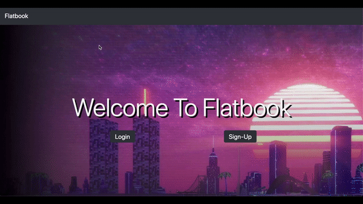
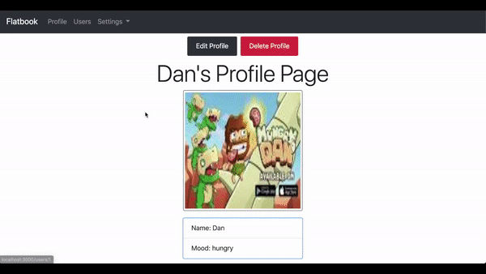
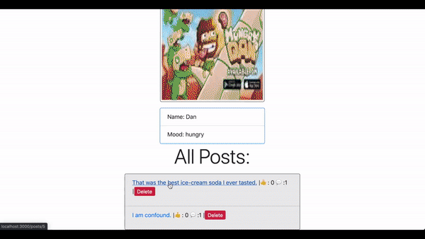

# Flatbook 👤

> A social media app inspired by Facebook.


Users can join the app and start creating new posts for all other users in the app.


## Overview

<b>Sign-in/Sign-up & Main Pages:</b> Users are greeted by a log-in and sign-up option. Once the user had sign/login, they are redirected to the main page, where all users' posts are going to be displayed.



<b>Profile & All Users Sections:</b>
Each user has a personal & customizable profile. Where they have the option to edit/update their profile. A quick overview of the current user posts is displayed. The app has an index for all users that had joined the app, every user has access to the index.



<b>Posting:</b>
The main page of flatbook allows users to quickly browse new posts and create post themselves.
For each individual post, users can comment and like the post. The creator of the post has the ability to edit/delete the post.



All media on the app is acquired by web scrapping technologies including:
<li /> User profile images
<li /> Post images


## Technologies
<ul>
<li />Ruby on Rails
<li />Bcrypt
<li />Sqlite3
<li />Nokogiri
<li />ActiveRecord
<li />HTML/CSS
<li />BootStrap
<li />Webpack Dev Server
</ul>


### Getting Started
These instructions will get you a copy of the project up and running on your local machine for development and testing purposes.
##### Prerequisites
<ul>
<li /> Ruby
<li /> Sqlite3
<li /> Open Weather API Key
<li /> Webpack Dev Server
</ul> 

##### Running


1. Clone/Download Repo.
2. move into project ``` cd flatbook```
3. run rails server on localhost.
    ```sh 
    rails server
    ```
4. run Webpack Dev Server  ```bin/webpack-dev-server```.


## Meta

Danny Brito – [LinkedIn](https://www.linkedin.com/in/dannybrito) - [Github](https://github.com/DannyBrito)
